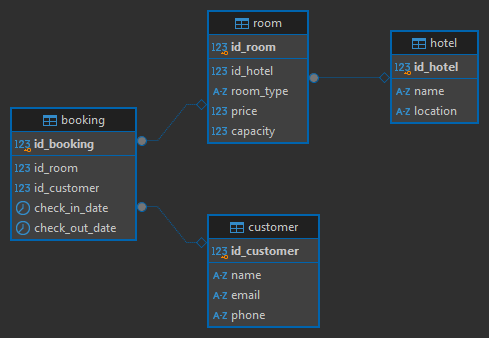

# Описание базы данных

## Общая информация
Данная база данных предназначена для управления бронированием номеров в отелях. Она включает информацию об отелях, номерах, клиентах и бронированиях.

## Структура базы данных

### 1. Таблица `Hotel`
Содержит информацию об отелях.

| Поле  | Тип | Описание |
|-------|-----|----------|
| `ID_hotel` | `SERIAL` | Уникальный идентификатор отеля (первичный ключ) |
| `name` | `VARCHAR(255)` | Название отеля |
| `location` | `VARCHAR(255)` | Местоположение отеля |

### 2. Таблица `Room`
Содержит информацию о номерах в отелях.

| Поле  | Тип | Описание |
|-------|-----|----------|
| `ID_room` | `SERIAL` | Уникальный идентификатор номера (первичный ключ) |
| `ID_hotel` | `INT` | Идентификатор отеля (внешний ключ) |
| `room_type` | `VARCHAR(20)` | Тип номера (`Single`, `Double`, `Suite`) |
| `price` | `DECIMAL(10,2)` | Цена за ночь (в долларах) |
| `capacity` | `INT` | Вместимость номера (количество человек) |

**Ограничения:**
- `ID_hotel` является внешним ключом, ссылающимся на `Hotel(ID_hotel)`.
- Поле `room_type` принимает только значения `Single`, `Double`, `Suite`.

### 3. Таблица `Customer`
Содержит информацию о клиентах.

| Поле  | Тип | Описание |
|-------|-----|----------|
| `ID_customer` | `SERIAL` | Уникальный идентификатор клиента (первичный ключ) |
| `name` | `VARCHAR(255)` | Имя клиента |
| `email` | `VARCHAR(255)` | Уникальный email клиента |
| `phone` | `VARCHAR(20)` | Телефон клиента |

**Ограничения:**
- Поле `email` должно быть уникальным.

### 4. Таблица `Booking`
Содержит информацию о бронировании номеров.

| Поле  | Тип | Описание |
|-------|-----|----------|
| `ID_booking` | `SERIAL` | Уникальный идентификатор бронирования (первичный ключ) |
| `ID_room` | `INT` | Идентификатор номера (внешний ключ) |
| `ID_customer` | `INT` | Идентификатор клиента (внешний ключ) |
| `check_in_date` | `DATE` | Дата заезда |
| `check_out_date` | `DATE` | Дата выезда |

**Ограничения:**
- `ID_room` является внешним ключом, ссылающимся на `Room(ID_room)`.
- `ID_customer` является внешним ключом, ссылающимся на `Customer(ID_customer)`.

## Связи между таблицами
- Таблица `Hotel` хранит информацию об отелях.
- Таблица `Room` содержит номера и связывается с `Hotel` через поле `ID_hotel`.
- Таблица `Customer` хранит данные о клиентах.
- Таблица `Booking` связывает клиентов и номера, фиксируя информацию о бронировании.

# ERD

# Задания

## Задание 1
**Условие** 
Определить, какие клиенты сделали более двух бронирований в разных отелях, и вывести информацию о каждом таком клиенте, включая его имя, электронную почту, телефон, общее количество бронирований, а также список отелей, в которых они бронировали номера (объединенные в одно поле через запятую с помощью CONCAT). Также подсчитать среднюю длительность их пребывания (в днях) по всем бронированиям. Отсортировать результаты по количеству бронирований в порядке убывания.

**Ожидаемый вывод для тестовых данных:**

|customer_name	|email	|phone	|total_bookings	|hotel_names	|average_days	|
|--- | --- | --- | --- | --- | --- |
|Bob Brown|	bob.brown@example.com|	+2233445566|	3|	Grand Hotel, Ocean View Resort|	3.0000|
|Ethan Hunt|	ethan.hunt@example.com|	+5566778899|	3|	Mountain Retreat, Ocean View Resort|	3.0000|

 

**Решение** представлено в файле `hotel_task_1.sql`

## Задание 2
**Условие** 
Необходимо провести анализ клиентов, которые сделали более двух бронирований в разных отелях и потратили более 500 долларов на свои бронирования. Для этого:

- Определить клиентов, которые сделали более двух бронирований и забронировали номера в более чем одном отеле. Вывести для каждого такого клиента следующие данные: ID_customer, имя, общее количество бронирований, общее количество уникальных отелей, в которых они бронировали номера, и общую сумму, потраченную на бронирования.

- Также определить клиентов, которые потратили более 500 долларов на бронирования, и вывести для них ID_customer, имя, общую сумму, потраченную на бронирования, и общее количество бронирований.

- В результате объединить данные из первых двух пунктов, чтобы получить список клиентов, которые соответствуют условиям обоих запросов. Отобразить поля: ID_customer, имя, общее количество бронирований, общую сумму, потраченную на бронирования, и общее количество уникальных отелей.

- Результаты отсортировать по общей сумме, потраченной клиентами, в порядке возрастания.

**Ожидаемый вывод для тестовых данных:** 

|ID_customer|	name|	total_bookings|	total_spent|	unique_hotels|
| --- | --- | --- | --- | --- |
|4|	Bob Brown|	3|	820.00|	2|
|7|	Ethan Hunt|	3|	850.00|	2|

>ТУТ ВОПРОС К ЗАДАНИЮ КАСАТЕЛЬНО ОЖИДАЕМОГО ВЫВОДА. ИЗ-ЗА ОБЪЕДИНЕНИЯ ДВУХ МНОЖЕСТ ТАМ БОЛЬШЕ ЛЮДЕЙ ДОЛЖНО БЫТЬ, ТАК КАК ПРОВЕРКИ НА ПОТРАЧЕННУЮ СУММУ И КОЛИЧЕСТВО БРОНИРОВАНИЙ В РАЗНЫХ ОТЕЛЯХ ПРОВОДЯТСЯ НЕЗАВИСИМО
 

**Решение** представлено в файле `hotel_task_2.sql`

## Задание 3
**Условие** 
Вам необходимо провести анализ данных о бронированиях в отелях и определить предпочтения клиентов по типу отелей. Для этого выполните следующие шаги:

1. Категоризация отелей.
Определите категорию каждого отеля на основе средней стоимости номера:

    - «Дешевый»: средняя стоимость менее 175 долларов.
    - «Средний»: средняя стоимость от 175 до 300 долларов.
    - «Дорогой»: средняя стоимость более 300 долларов.

2. Анализ предпочтений клиентов.
Для каждого клиента определите предпочитаемый тип отеля на основании условия ниже:

    - Если у клиента есть хотя бы один «дорогой» отель, присвойте ему категорию «дорогой».
    - Если у клиента нет «дорогих» отелей, но есть хотя бы один «средний», присвойте ему категорию «средний».
    - Если у клиента нет «дорогих» и «средних» отелей, но есть «дешевые», присвойте ему категорию предпочитаемых отелей «дешевый».

3. Вывод информации.
Выведите для каждого клиента следующую информацию:

    - ID_customer: уникальный идентификатор клиента.
    - name: имя клиента.
    - preferred_hotel_type: предпочитаемый тип отеля.
    - visited_hotels: список уникальных отелей, которые посетил клиент.

4. Сортировка результатов.
Отсортируйте клиентов так, чтобы сначала шли клиенты с «дешевыми» отелями, затем со «средними» и в конце — с «дорогими».

**Ожидаемый вывод для тестовых данных:**

|ID_customer	|name	|preferred_hotel_type	|visited_hotels |
| --- | --- | --- | --- |
|10	|Hannah Montana	|Дешевый	|City Center Inn|
|1	|John Doe	|Средний	|City Center Inn,Grand Hotel|
|2	|Jane Smith	|Средний	|Grand Hotel|
|3	|Alice Johnson	|Средний	|Grand Hotel|
|4	|Bob Brown	|Средний	|Grand Hotel,Ocean View Resort|
|5	|Charlie White	|Средний	|Ocean View Resort|
|6	|Diana Prince	|Средний	|Ocean View Resort|
|7	|Ethan Hunt	|Дорогой	|Mountain Retreat,Ocean View Resort|
|8	|Fiona Apple	|Дорогой	|Mountain Retreat|
|9	|George Washington	|Дорогой	|City Center Inn,Mountain Retreat|

 

**Решение** представлено в файле `hotel_task_3.sql`