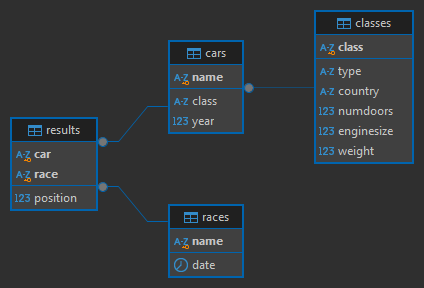

# Описание базы данных

## Общая информация
Данная база данных предназначена для хранения информации о классах автомобилей, самих автомобилях, гонках и их результатах. Она может использоваться для ведения статистики автомобильных соревнований.

## Структура базы данных

### 1. Таблица `Classes`
Содержит информацию о классах автомобилей.

| Поле  | Тип | Описание |
|-------|-----|----------|
| `class` | `VARCHAR(100)` | Название класса автомобиля (уникальный идентификатор) |
| `type` | `VARCHAR(20)` | Тип класса (`Racing`, `Street`) |
| `country` | `VARCHAR(100)` | Страна происхождения |
| `numDoors` | `INT` | Количество дверей |
| `engineSize` | `DECIMAL(3,1)` | Объем двигателя (в литрах) |
| `weight` | `INT` | Вес автомобиля (в килограммах) |

**Ограничения:**
- `class` является первичным ключом.
- Поле `type` принимает только значения `Racing` или `Street`.

### 2. Таблица `Cars`
Содержит информацию об автомобилях.

| Поле  | Тип | Описание |
|-------|-----|----------|
| `name` | `VARCHAR(100)` | Название автомобиля (уникальный идентификатор) |
| `class` | `VARCHAR(100)` | Класс автомобиля (ссылка на `Classes`) |
| `year` | `INT` | Год выпуска |

**Ограничения:**
- `name` является первичным ключом.
- Поле `class` является внешним ключом, ссылающимся на `Classes(class)`.

### 3. Таблица `Races`
Содержит информацию о гонках.

| Поле  | Тип | Описание |
|-------|-----|----------|
| `name` | `VARCHAR(100)` | Название гонки (уникальный идентификатор) |
| `date` | `DATE` | Дата проведения гонки |

**Ограничения:**
- `name` является первичным ключом.

### 4. Таблица `Results`
Содержит результаты гонок.

| Поле  | Тип | Описание |
|-------|-----|----------|
| `car` | `VARCHAR(100)` | Автомобиль (ссылка на `Cars`) |
| `race` | `VARCHAR(100)` | Гонка (ссылка на `Races`) |
| `position` | `INT` | Занятое место |

**Ограничения:**
- Композитный первичный ключ (`car`, `race`).
- Поле `car` является внешним ключом, ссылающимся на `Cars(name)`.
- Поле `race` является внешним ключом, ссылающимся на `Races(name)`.

## Связи между таблицами
- Таблица `Classes` содержит информацию о категориях автомобилей.
- Таблица `Cars` хранит автомобили и связывается с `Classes` через поле `class`.
- Таблица `Races` содержит данные о гонках.
- Таблица `Results` связывает автомобили и гонки, фиксируя результаты заезда.

# ERD

# Задания

## Задание 1
**Условие** 
Определить, какие автомобили из каждого класса имеют наименьшую среднюю позицию в гонках, и вывести информацию о каждом таком автомобиле для данного класса, включая его класс, среднюю позицию и количество гонок, в которых он участвовал. Также отсортировать результаты по средней позиции.

**Ожидаемый вывод для тестовых данных:**

|car_name	|car_class	|average_position	|race_count |
| --- | --- | --- | --- |
|Ferrari 488	|Convertible	|1.0000	|1 |
|Ford Mustang	|SportsCar	|1.0000	|1 |
|Toyota RAV4	|SUV	|2.0000	|1 |
|Mercedes-Benz S-Class	|Luxury Sedan	|2.0000	|1 |
|BMW 3 Series	|Sedan	|3.0000	|1 |
|Chevrolet Camaro	|Coupe	|4.0000	|1 |
|Renault Clio	|Hatchback	|5.0000	|1 |
|Ford F-150	|Pickup	|6.0000	|1 |

 

**Решение** представлено в файле `racing_task_1.sql`

## Задание 2
**Условие** 
Определить автомобиль, который имеет наименьшую среднюю позицию в гонках среди всех автомобилей, и вывести информацию об этом автомобиле, включая его класс, среднюю позицию, количество гонок, в которых он участвовал, и страну производства класса автомобиля. Если несколько автомобилей имеют одинаковую наименьшую среднюю позицию, выбрать один из них по алфавиту (по имени автомобиля).

**Ожидаемый вывод для тестовых данных:**

|car_name	|car_class	|average_position	|race_count	|production_country |
| --- | --- | --- | --- | --- |
|Ferrari 488	|Convertible	|1.0000	|1	|Italy |

 

**Решение** представлено в файле `racing_task_2.sql`

## Задание 3
**Условие** 
Определить классы автомобилей, которые имеют наименьшую среднюю позицию в гонках, и вывести информацию о каждом автомобиле из этих классов, включая его имя, среднюю позицию, количество гонок, в которых он участвовал, страну производства класса автомобиля, а также общее количество гонок, в которых участвовали автомобили этих классов. Если несколько классов имеют одинаковую среднюю позицию, выбрать все из них.

**Ожидаемый вывод для тестовых данных:**

|car_name	|car_class	|average_position	|race_count	|production_country	|total_race_count |
| --- | --- | --- | --- | --- | --- |
|Ferrari 488	|Convertible	|1.0000	|1	|Italy	|1|
|Ford Mustang	|SportsCar	|1.0000	|1	|USA	|1|

 

**Решение** представлено в файле `racing_task_3.sql`

## Задание 4
**Условие** 
Определить, какие автомобили имеют среднюю позицию лучше (меньше) средней позиции всех автомобилей в своем классе (то есть автомобилей в классе должно быть минимум два, чтобы выбрать один из них). Вывести информацию об этих автомобилях, включая их имя, класс, среднюю позицию, количество гонок, в которых они участвовали, и страну производства класса автомобиля. Также отсортировать результаты по классу и затем по средней позиции в порядке возрастания.

**Ожидаемый вывод для тестовых данных:**

|car_name	|car_class	|average_position	|race_count	|production_country	|
| --- | --- | --- | --- | --- |
|BMW 3 Series| Sedan| 3.0| 1| Germany|
|Toyota RAV4|	SUV| 2.0000| 1|	Japan|

 

**Решение** представлено в файле `racing_task_4.sql`

## Задание 5
**Условие** 
Определить, какие классы автомобилей имеют наибольшее количество автомобилей с низкой средней позицией (больше 3.0) и вывести информацию о каждом автомобиле из этих классов, включая его имя, класс, среднюю позицию, количество гонок, в которых он участвовал, страну производства класса автомобиля, а также общее количество гонок для каждого класса. Отсортировать результаты по количеству автомобилей с низкой средней позицией.

**Ожидаемый вывод для тестовых данных:**

|car_name	|car_class	|average_position	|race_count	|production_country	|total_race_count	|class_race_count |
| --- | --- | --- | --- | --- | --- | --- |
|Audi A4|	Sedan|	8.0000|	1|	Germany|	2|	2|
|Chevrolet Camaro|	Coupe|	4.0000|	1|	USA|	1|	1|
|Renault Clio|	Hatchback|	5.0000|	1|	France|	1|	1|
|Ford F-150|	Pickup|	6.0000|	1|	USA|	1|	1|

 

**Решение** представлено в файле `racing_task_5.sql`